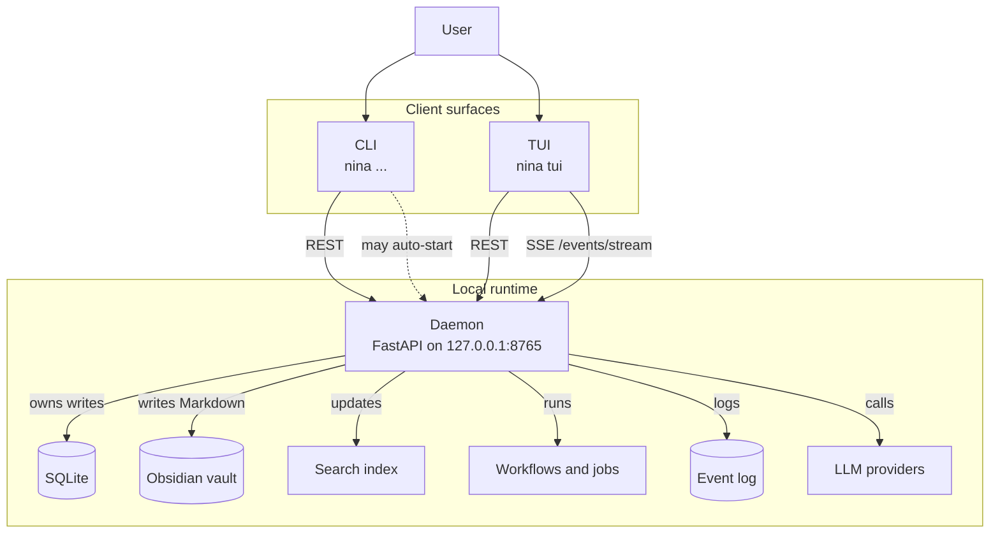
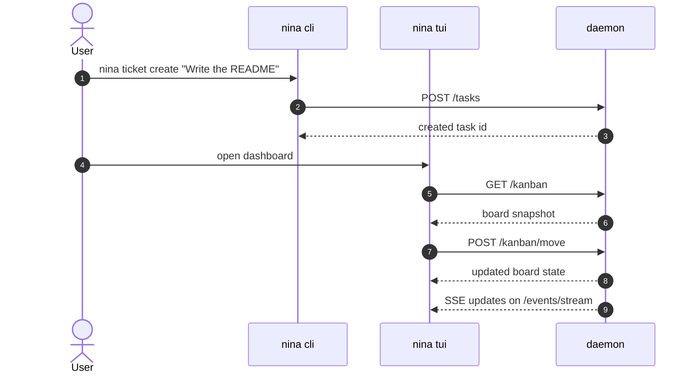

# Nina

Nina is a local-first personal operations platform. It runs a daemon on your machine, stores operational state in SQLite, mirrors useful context into an Obsidian vault, and exposes the same data through a CLI and a terminal UI.

It is designed for one person's workflow, not a multi-user SaaS.

## What Nina Does

- Manage projects and tasks through a kanban board.
- Create tickets from the CLI, TUI, or agent mode.
- Ask questions in chat mode without running commands.
- Use agent mode to plan and auto-run safe `nina` commands.
- Run research workflows that write summary-plus-links notes into Obsidian.
- Index the vault for fast local search.
- Persist LLM interactions and workflow runs for inspection.

## Current Surface

- **Daemon**: FastAPI server that owns SQLite, Obsidian writes, LLM calls, workflows, jobs, and session state.
- **CLI**: Typer-based commands for `project`, `task`, `ticket`, `job`, `research`, `workflow`, `ask`, `status`, and `daemon`.
- **TUI**: OpenTUI terminal interface with dedicated `Tickets`, `Chat`, `Agent`, `Research`, `Meetings`, `Jobs`, and `Config` tabs.
- **Core**: Shared models, database, search, Obsidian, LLM, research, session, and workflow services.

## Modes

### Tickets

Ticket mode is a first-class alias over Nina tasks. You can create, list, move, and complete tickets from the CLI or TUI while the underlying storage remains the same task model.

Example:

```bash
nina ticket create "Fix daemon stop recursion" --description "POSIX stop handling was recursing instead of terminating."
nina ticket move <ticket-id> --column Doing
nina ticket done <ticket-id>
```

### Chat

Chat mode answers questions with local Obsidian context and LLM reasoning. It does not execute CLI commands.

Example:

```bash
nina tui
# open the Chat tab and ask a question
```

### Agent

Agent mode can use an LLM to plan a sequence of `nina` commands and auto-run them. It never runs arbitrary shell commands.

This is the path for natural-language task creation:

```text
Create a ticket to fix daemon stop and put it in Doing.
```

Agent mode should be able to translate that into ticket creation plus any follow-up `nina` command needed to move the item.

### Research

Research mode uses OpenAI web search for live lookup and writes a Markdown note into Obsidian containing a summary and source links.

Example:

```bash
nina research run "OpenAI web search"
```

The generated note lands under `Research/YYYY-MM-DD - <topic>.md`.

### Meetings

Meeting mode records audio from the local machine (mic or system audio), writes the WAV to the active profile, and creates an Obsidian note under `Meetings/`. It runs on Linux (and on WSL2) without any extra cloud services. Use `--source system` to capture the PulseAudio/PipeWire monitor so other participants on a Teams, Zoom, Meet, or Discord call are picked up alongside the user's mic.

Compact form — `nina r` is the shortest path:

```bash
nina r "Quarterly planning"
# ... join the meeting in Teams/Zoom/Meet/Discord ...
# Ctrl+C to stop
nina mt t <meeting-id>   # transcribe (local faster-whisper)
nina mt m <meeting-id>   # summarize (LLM)
nina mt o <meeting-id>   # open the note in Obsidian
```

Long form (does the same thing):

```bash
nina meeting record "Quarterly planning"
nina meeting transcribe <meeting-id>
nina meeting summarize <meeting-id>
nina meeting open <meeting-id>
```

Available compact meeting subcommands: `r` (record), `ls` (list), `t` (transcribe), `m` (summarize), `s` (stop), `o` (open), `p` (play), `rm` (delete), `x` (show), `devices`. Use `nina mt <sub> --help` for flags.

Other shortcuts: `nina h` (compact help), `nina -h` (full help), `nina t` (TUI), `nina d` (daemon), `nina n` (note), `nina p` (project), `nina tk` (ticket), `nina k` (kanban), `nina j` (job), `nina c` (config), `nina ll` (llm), `nina rch` (research), `nina s` (search). Short aliases are hidden from `--help` so the main command list stays readable; they're fully wired and tested.

The generated note lands under `Meetings/YYYY-MM-DD - <title>.md` with sections for transcript, summary, action items, and decisions. Transcription runs locally with `faster-whisper`; summarization reuses the configured LLM provider (`codex` or `openai`).

## Architecture

Nina is a local client-server app. The daemon is the source of truth for state and writes, and the CLI and TUI only talk to it over localhost.





- `apps/server`: FastAPI daemon that owns the runtime and exposes the local API.
- `apps/cli`: Typer CLI that talks to the daemon over HTTP.
- `apps/tui`: OpenTUI client that talks to the daemon over HTTP and SSE.
- `packages/nina_core`: shared application logic, models, services, and workflows.

The daemon is the source of truth for state. The CLI and TUI are clients, and the TUI keeps a live stream open for updates.

## Installation

### Prerequisites

- Python 3.12
- `uv`
- `bun`
- An Obsidian vault path
- An OpenAI API key for chat, agent, and research modes
- Codex auth file if you want to use the Codex provider explicitly

### Setup

```bash
make build
nina init
```

That builds and installs the local Nina runtime and launcher, then creates the local Nina profile, SQLite database, token, and vault structure. Make sure `~/.local/bin` is on your PATH before running `nina init`.

`make build` and `make check-build` now fail fast if Python 3.12 is not available to `uv`.

Use `nina config open` to open the active profile folder in VS Code.

Install commands:

```bash
nina setup
nina setup transcription
nina setup python
```

Uninstall commands:

```bash
nina uninstall
make uninstall
```

`nina uninstall` removes the launcher, install root, and Nina config/data by default.

## Quick Start

Start the daemon:

```bash
uv run nina daemon start
```

Check status:

```bash
uv run nina status
```

`nina status` shows daemon health plus the current LLM, transcription, and meeting setup state.

Create a ticket:

```bash
uv run nina ticket create "Write the README" --description "Document the daemon, CLI, TUI, chat, agent, and research flows."
```

Ask a question:

```bash
uv run nina ask "What is already in the vault about Codex auth?"
```

Run a research topic:

```bash
uv run nina research run "OpenAI web search"
```

Launch the TUI:

```bash
uv run nina tui
```

Short aliases: `uv run nina d` for `uv run nina daemon`, `uv run nina d r` for `uv run nina daemon restart`, and `uv run nina t` for `uv run nina tui`.

## Configuration

Nina uses `NINA_CONFIG_DIR` to point at a profile directory. If it is not set, the default profile lives under `~/.nina/default`.

All Nina configuration lives in `<config_dir>/config.yaml`. The CLI and daemon both read from it; nothing is hidden in environment variables.

External credentials (not Nina's config) still come from the environment:

- `CODEX_AUTH_FILE`: path to the Codex auth JSON used by the `codex` provider. Default: `~/.codex/auth.json`.
- `OPENAI_API_KEY`: required for the explicit `openai` LLM provider and research mode.

The default chat/agent path is `openai`, which uses `OPENAI_API_KEY`; Codex is still available if you switch the provider explicitly.

Saved config covers the vault path, database path, daemon host/port, log level, LLM provider/model, research provider/model, daily summary schedule, transcription backend/model/device/compute-type/language, and meetings default source. Inspect it with `nina config show`, change it with `nina config vault`, `nina config database`, `nina config daemon-host`, `nina config daemon-port`, `nina config log-level`, `nina config llm-provider`, `nina config llm-model`, `nina config research-provider`, `nina config research-model`, `nina config daily-summary-time`, `nina config transcription-backend`, `nina config transcription-model`, `nina config transcription-device`, `nina config transcription-compute-type`, `nina config transcription-language`, `nina config meetings-source`, and `nina config auto-summarize`, or edit the same fields from the TUI Settings tab. The daemon writes a small `daemon.json` runtime file in the config directory so CLI and TUI clients keep talking to the live host and port until the next restart.

When adding new configuration, give every field a default in the Pydantic model so old config files keep working. New blocks should appear in `nina config show` automatically.

## Obsidian Integration

Nina writes Markdown into the vault so the notes stay portable.

Current folders created by `nina init`:

- `Projects/`
- `Tasks/`
- `Research/`
- `Research/Sources/`
- `Meetings/`
- `Daily/`
- `Templates/`
- `System/`
- `System/Deleted/`
- `System/Indexes/`
- `System/Logs/`

Research notes include:

- a Markdown summary
- source links
- frontmatter with `nina_type: research_report`
- the research topic
- the workflow run ID

## Development

Useful Make targets:

```bash
make help
make build
make doctor
make dev
make smoke
make check
make tui
```

Common direct commands:

```bash
uv run pytest tests/
uv run pytest tests/ -m unit
uv run pytest tests/ -m integration
cd apps/tui && bun run check
```

## Validation

The repository is meant to be validated in layers:

- `uv run pytest tests/` for the Python suite.
- `cd apps/tui && bun run check` for the TUI TypeScript check.
- `make smoke` for the temp-data end-to-end flow.

The smoke path initializes isolated data, starts the daemon, creates a ticket, lists tickets, checks the TUI typecheck, and shuts the daemon down again.

## Roadmap

Current implementation is usable but still early. Likely next steps include:

- richer TUI interactions and keyboard shortcuts
- SearxNG as an additional research backend
- richer ticket workflows and templates
- note opening and external-editor integrations
- better LLM streaming and tool-call visibility in the TUI

## Contributing

Issues and pull requests should include a short description of the user flow being improved and the validation commands used to prove it.

If you add a new feature, update the README and the relevant tests in the same change.

## License

MIT.
