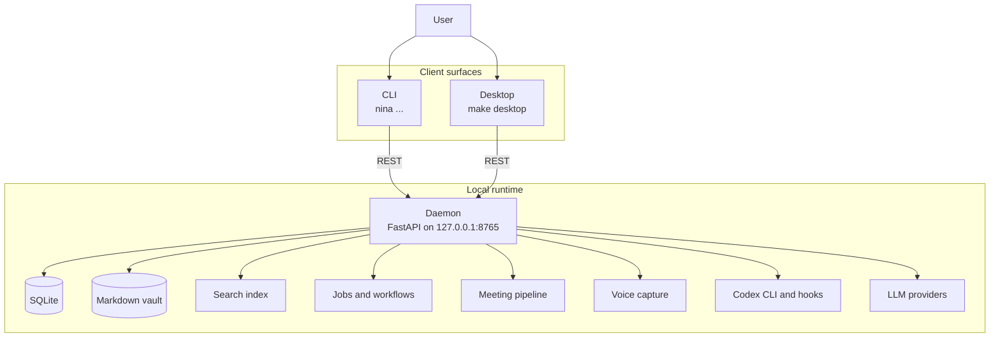

# Nina

Nina is a local-first personal operations platform. It runs a daemon on your machine, keeps operational state in SQLite, mirrors durable context into an Obsidian-compatible Markdown vault, and exposes the same data through a CLI and GPUI desktop client.

Nina is designed for one person's workflow, not a multi-user SaaS.

## What It Does

- Manage tasks, tickets, projects, jobs, notes, repositories, and meetings from one local runtime.
- Run a FastAPI daemon that owns SQLite, Obsidian writes, search indexing, workflows, meetings, and Codex lifecycle state.
- Use a Typer CLI for fast commands and automation-friendly JSON output.
- Use a GPUI desktop client for mouse-first access to the same daemon-backed workflows.
- Search and ask questions over the local vault.
- Record meetings, transcribe locally, summarize with the configured LLM provider, and write meeting notes.
- Record short voice captures for local transcription, clipboard copy, and desktop global dictation.
- Use the local Codex CLI as the default LLM and research path.
- Integrate with Codex task automation through a local plugin and lifecycle hooks.

## Project Status

Nina is early local software. The repository is useful for development and personal workflows, but APIs and UX are still expected to change.

## Repository Layout

```text
.
|-- apps/
|   |-- cli/           # Typer CLI, installed as `nina`
|   |-- desktop/       # GPUI desktop client, run with Cargo
|   `-- server/        # FastAPI daemon
|-- packages/
|   `-- nina_core/     # Domain services, config, DB, LLM, search, workflows
|-- nina-codex-plugin/ # Local Codex plugin bundle and lifecycle hooks
|-- scripts/           # Build, development, and installer helpers
|-- tests/             # Unit and integration tests
|-- AGENTS.md          # Project instructions for Codex agents
`-- .agents/skills/    # Repo-scoped Codex skills
```

## Architecture

Nina is a local client-server app. The daemon is the source of truth for state and writes. The CLI and desktop client communicate with it over localhost.



Package boundaries:

- `apps/server`: FastAPI daemon and routers.
- `apps/cli`: command-line client and output formatting.
- `apps/desktop`: GPUI desktop client.
- `packages/nina_core`: shared application logic, models, services, and workflows.
- `nina-codex-plugin`: installable local Codex plugin used by Nina's task runner.

## Requirements

- Python 3.12
- `uv`
- Rust/Cargo, for the GPUI desktop client
- Codex CLI, for the default LLM/research provider
- An Obsidian-compatible vault path, created automatically by `nina init` if omitted

On Linux, the GPUI desktop client links against native `xcb`, `xkbcommon`, and `xkbcommon-x11` runtime libraries. Desktop global dictation uses the XDG Desktop Portal Global Shortcuts API while Nina Desktop is open, with the Nina window/taskbar title showing recording state. Clipboard paste insertion expects `wl-clipboard` plus `ydotool` on Wayland, with `xclip`/`xsel`, `xdotool`, and `xte` fallbacks on X11.

Optional meeting and voice transcription support installs `faster-whisper` through the `nina-core[transcription]` extra or `nina setup transcription`.

## Install

From the repository root:

```bash
make build
nina init
```

`make build` syncs Python dependencies, builds Nina, and refreshes the local Nina Codex plugin. The installed CLI entry point is `nina`.

Check the local install:

```bash
make doctor
nina status
```

To uninstall local Nina runtime and data:

```bash
nina uninstall
```

## Configure LLM Access

Nina uses the local Codex CLI by default. Log in once:

```bash
codex login
```

Then confirm Nina is set to Codex-backed providers:

```bash
nina config llm-provider codex
nina config llm-model gpt-5.5
nina config research-provider codex
nina config research-model gpt-5.5
nina config research-search-mode live
nina llm test "Reply with auth ok"
```

See [CONFIG_LLM.md](CONFIG_LLM.md) for the short setup guide.

## Quick Start

Start the daemon:

```bash
nina daemon start
```

Create and inspect work:

```bash
nina ticket create "Write the README" --description "Document setup, architecture, and validation."
nina ticket list
nina ask "What is in my vault about Codex?"
nina research run "modern mobile authentication patterns"
```

Launch the desktop client from the repository:

```bash
make desktop
```

The desktop client connects only to the local daemon. Start the daemon first with `nina daemon start` or `make dev-start`. On Linux, `make desktop` also refreshes Nina's user desktop entry and taskbar icon metadata.

Record a meeting:

```bash
nina r "Planning sync"
# Ctrl+C to stop recording
nina mt e <meeting-id>
nina mt o <meeting-id>
```

Record a voice clip and copy the transcript. Voice captures default to 16 kHz mono with no post-processing for local transcription speed unless a client explicitly overrides the recording options:

```bash
nina vc r --copy
# Ctrl+C to stop recording and transcribe
```

Enable desktop global dictation while Nina Desktop is open:

```bash
nina config voice-global-hotkey-enabled true
nina config voice-global-hotkey "Ctrl+Alt+Space"
make desktop
```

The desktop Settings page can capture and register the global hotkey. The Transcriptions tab lists recent CLI and desktop captures, can stop a recovered global recording, and can clean recent non-active recordings to reclaim space.

Useful compact aliases include `nina d` for daemon commands, `nina tk` for tickets, `nina mt` for meetings, `nina vc` for voice capture, `nina c` for config, `nina ll` for LLM, `nina rch` for research, and `nina s` for search.

## Configuration

The default profile lives under:

```text
~/.nina/default
```

Common commands:

```bash
nina config show
nina config vault <path>
nina config database <path>
nina config daemon-port 8765
nina config log-level INFO
nina config llm-provider codex
nina config llm-model gpt-5.5
nina config research-provider codex
nina config research-model gpt-5.5
nina config research-search-mode live
nina config research-timeout 600
nina config voice-global-hotkey-enabled true
nina config voice-global-hotkey "Ctrl+Alt+Space"
nina config voice-preserve-clipboard true
nina open config
```

Configuration is stored in `config.yaml` inside the active profile directory. Secrets such as bearer tokens and Codex passwords are stored separately.

## Development

Common commands:

```bash
make help
make dev
make dev-status
make cli ARGS="status"
make desktop
make smoke-research
make test
make check
make package
```

Python checks:

```bash
uv run pytest tests/
uv run pytest tests/ -m unit
uv run pytest tests/ -m integration
uv run ruff check .
uv run pyright
```

Desktop checks:

```bash
make desktop-check
make desktop-bacon  # optional, requires bacon
```

Local packaging:

```bash
make package
make package-cli
make package-desktop
```

`make package` writes local CLI wheel archives and the current-host desktop binary archive under `release/assets`. Set `PACKAGE_NAME=...` to change archive names, `PACKAGE_DIR=...` to change the output directory, or `PACKAGE_COMPONENTS=cli|desktop|all` to build a subset.

End-to-end smoke:

```bash
make smoke
make smoke-research
RESEARCH_TOPIC="modern mobile authentication patterns" CODEX_MODEL=gpt-5.5 make smoke-research
```

`make smoke` uses the selected Nina profile, defaulting to `default`. `make smoke-research` uses the running daemon or starts it, runs `nina research run ... --json` through live Codex web search, and verifies that the Obsidian note exists with a summary and sources. The optional real CLI plus daemon smoke test is excluded from the default test suite and can be run with:

```bash
uv run pytest -m daemon_smoke tests/integration/test_cli_daemon_smoke.py
NINA_LIVE_CODEX_RESEARCH=1 uv run pytest -m daemon_smoke tests/integration/test_cli_daemon_smoke.py -k live_research
```

## Documentation

- [CONFIG_LLM.md](CONFIG_LLM.md): Codex CLI LLM setup.
- [apps/cli/README.md](apps/cli/README.md): CLI component summary.
- [apps/server/README.md](apps/server/README.md): daemon component summary.
- [packages/nina_core/README.md](packages/nina_core/README.md): core package summary.
- [tests/README.md](tests/README.md): test strategy and test layers.
- [nina-codex-plugin/README.md](nina-codex-plugin/README.md): plugin replication and lifecycle hook contract.
- [AGENTS.md](AGENTS.md): project instructions loaded by Codex agents.
- `.agents/skills/`: repo-scoped Codex skills for architecture, CLI/API, Codex integration, development, and workflows/LLM work.

## Contributing

Issues and pull requests should describe the user flow being improved and list the validation commands that were run.

When changing public behavior, update the README or nearest component documentation in the same change. When changing agent-facing workflows, update `AGENTS.md` or the relevant `.agents/skills/*` skill.

## License

MIT.
